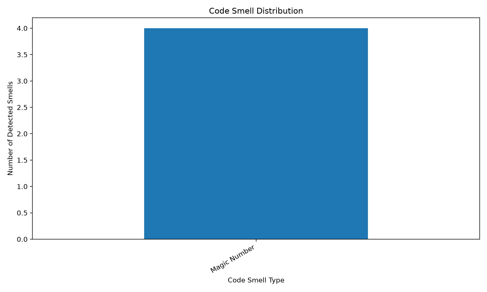
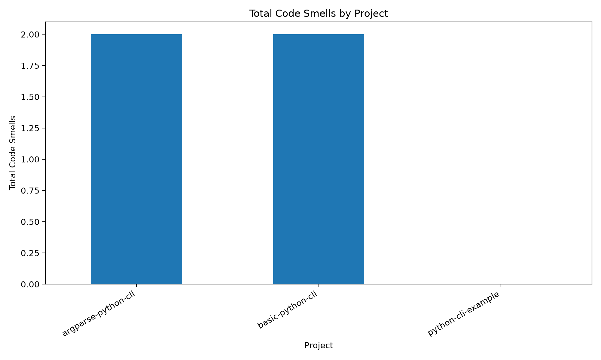
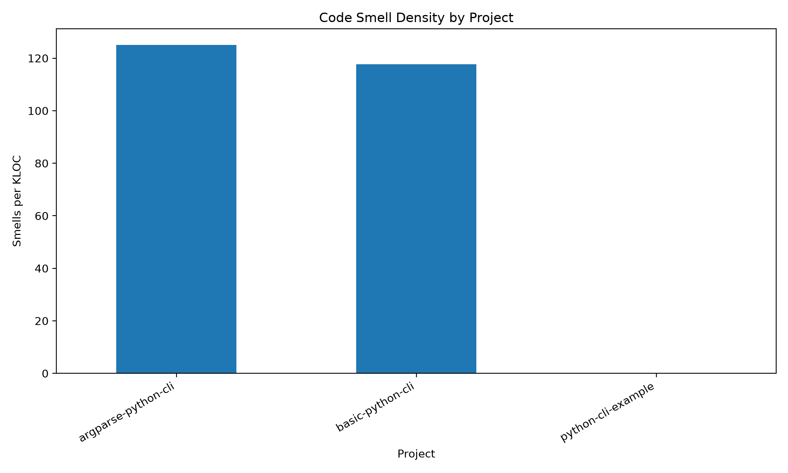

# Python Code Smell Detector


A lightweight static analysis tool for detecting maintainability issues in Python code.

## Background

Code smells are patterns in source code that may indicate potential maintainability problems. They do not always cause bugs directly, but they can make code harder to understand, test, modify, and extend.

This project builds a simple Python-based static analysis tool for detecting common code smells in beginner-level Python programs. The tool uses Python's built-in `ast` module to parse source code and apply rule-based detection.

## Detected Code Smells

The current version detects five types of code smells:

| Code Smell          | Description                                                                |
| ------------------- | -------------------------------------------------------------------------- |
| Long Method         | A function is too long and may be difficult to understand.                 |
| Too Many Parameters | A function has too many parameters and may have too many responsibilities. |
| Deep Nesting        | A function contains deeply nested `if`, `for`, or `while` statements.      |
| Magic Number        | A numeric constant appears directly in the source code.                    |
| Broad Exception     | The code catches `Exception` directly, which may hide real errors.         |

## Project Structure

```text
python-code-smell-detector/
├── .github/
│   └── workflows/
│       └── python-tests.yml
├── src/
│   ├── analyzer.py
│   ├── smell_rules.py
│   └── report_generator.py
├── examples/
│   ├── bad_code.py
│   ├── clean_code.py
│   └── long_method_code.py
├── tests/
│   └── test_smell_rules.py
├── docs/
│   ├── rule_definitions.md
│   └── mini_report.md
├── results/
│   ├── figures/
│   └── tables/
│       └── example_summary.csv
├── README.md
├── requirements.txt
├── .gitignore
└── LICENSE
```

## Installation

Clone the repository:

```bash
git clone https://github.com/Yihao-Xu-777/python-code-smell-detector.git
cd python-code-smell-detector
```

Install dependencies:

```bash
pip install -r requirements.txt
```

## How to Run

Analyze a single Python file:

```bash
python src/analyzer.py examples/bad_code.py
```

Analyze a folder:

```bash
python src/analyzer.py examples
```

Generate a CSV report:

```bash
python src/analyzer.py examples --csv results/tables/example_summary.csv
```

Run tests:

```bash
pytest
```

If `pytest` is not recognized, run:

```bash
python -m pytest
```

## Example Output

```text
============================================================
Python Code Smell Report
============================================================
File: examples/bad_code.py
[Too Many Parameters] Line 1
Function: process_student_data
Message: Function 'process_student_data' has 7 parameters.
------------------------------------------------------------
File: examples/bad_code.py
[Magic Number] Line 4
Function: None
Message: Magic number detected: 10
------------------------------------------------------------
File: examples/bad_code.py
[Broad Exception] Line 13
Function: None
Message: Broad exception handler detected: except Exception.
------------------------------------------------------------
File: examples/bad_code.py
[Deep Nesting] Line 1
Function: process_student_data
Message: Function 'process_student_data' has nesting depth 4.
------------------------------------------------------------
```

## Results

This project produces two types of analysis results:

1. Example-level results for the sample files in the `examples/` folder.
2. Empirical evaluation results for several small open-source Python CLI projects.

## Example File Analysis

The tool can analyze local Python files and generate a CSV report containing all detected code smells.

Example command:

```bash
python src/analyzer.py examples --csv results/tables/example_summary.csv
```

Example result file:

```text
results/tables/example_summary.csv
```

The CSV report includes:

| Column   | Meaning                      |
| -------- | ---------------------------- |
| file     | The analyzed Python file     |
| type     | The detected code smell type |
| function | The related function name    |
| line     | The line number of the smell |
| message  | The explanation of the smell |

## Empirical Evaluation

In V3, this tool was evaluated on three small open-source Python CLI projects placed in the `evaluation_projects/` folder.

The evaluated projects are:

| Project             | Description                                   |
| ------------------- | --------------------------------------------- |
| argparse-python-cli | A small Python CLI project using `argparse`   |
| basic-python-cli    | A basic Python command-line interface example |
| python-cli-example  | A small Python CLI example project            |

The evaluation generated two CSV result files:

```text
results/tables/open_source_summary.csv
results/tables/open_source_smell_details.csv
```

The project-level summary includes the number of analyzed files, lines of code, total detected smells, smells per KLOC, and counts for each smell type.

The smell-level details include the project name, file path, smell type, related function, line number, and explanation message.

### Result Figures

#### Code Smell Distribution



#### Total Code Smells by Project



#### Code Smell Density by Project



### Interpretation

The evaluated projects are small Python CLI example projects, so the total number of detected smells is relatively low. For example, `python-cli-example` had no detected smells under the current rule settings.

The main purpose of this evaluation is to demonstrate a reproducible static analysis workflow, including project-level analysis, CSV result generation, and result visualization. Therefore, the results should be interpreted as a workflow demonstration rather than a strong conclusion about the overall quality of these projects.

Since some projects have very few lines of code, the smell density value should also be interpreted carefully. A small number of detected smells may lead to a relatively high smells-per-KLOC value when the project size is small.


## Testing

This project uses `pytest` for unit testing.

Current tests cover:

* Too Many Parameters detection
* Magic Number detection
* Broad Exception detection
* Deep Nesting detection
* Long Method detection

Run all tests:

```bash
pytest
```

Expected result:

```text
5 passed
```

## Rule Definitions

Detailed rule definitions are available in:

```text
docs/rule_definitions.md
```

The current detection rules are threshold-based. For example, a function is reported as a Long Method if it contains more than 30 lines.

## Mini Report

A short project report is available in:

```text
docs/mini_report.md
```

The report describes the project objective, methodology, current evaluation, limitations, and future work.

## Current Limitations

* The current rules are simple and threshold-based.
* The magic number rule may report some acceptable constants.
* The tool currently focuses on beginner-level Python programs.
* Duplicate code detection is not included yet.
* The current evaluation mainly uses small example files.

## Future Work

Planned improvements include:

* Add duplicate code detection
* Improve magic number detection
* Generate HTML reports
* Add project-level summary statistics
* Evaluate the tool on open-source Python repositories
* Add more test cases for edge situations
* Improve the command-line interface

## What I Learned

Through this project, I practiced:

* Python abstract syntax tree analysis
* Rule-based static analysis
* Code smell detection
* Unit testing with `pytest`
* CSV report generation
* GitHub project organization
* GitHub Actions automated testing

## License

This project is licensed under the MIT License.
